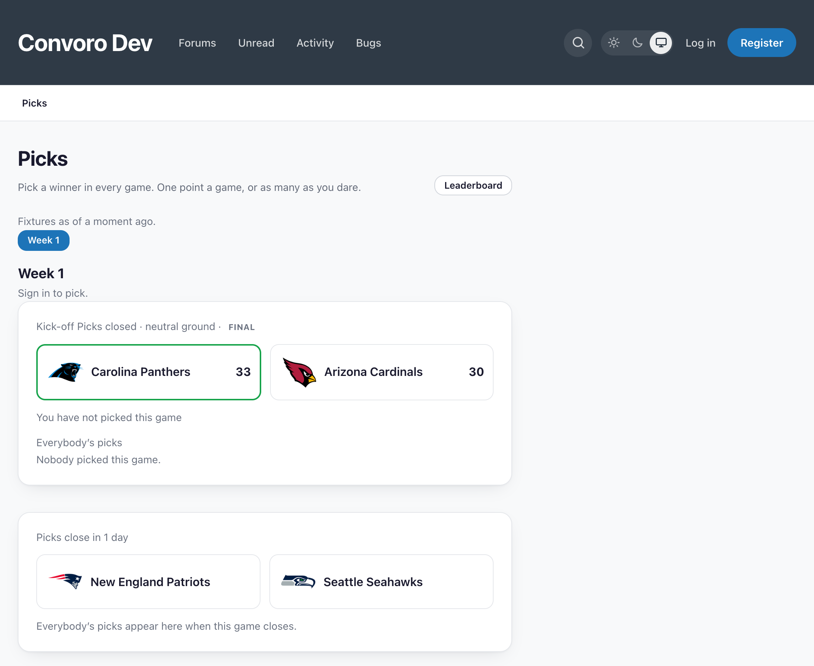

# Picks

A **pick'em** for [Convoro](https://convoro.co). Members predict the winner of
every game in a round, earn points, and climb a season leaderboard.



Third-party extension by Ernest Defoe.

## More than one sport

A season belongs to a **league**, and the league decides where its fixtures come
from:

| League | Source |
|---|---|
| College football | CollegeFootballData |
| NFL, NBA, MLB, NHL, college basketball, MLS, Premier League, Champions League | ESPN |

Create a season in **Admin → Picks → Seasons → Follow a league**, pick a
competition and a year, and the fixtures arrive on the next sync. Nothing else
changes: the same picks, the same leaderboard, the same screens. A board that
follows only college football carries on exactly as before — every existing
season defaults to it, because every existing row came from there.

Two things follow from the sports, and both are the whole of the work:

**Most sports have no weeks.** Gridiron numbers its rounds; everything else is
played to a date. A league without weeks gets one week per calendar week, which
is what a pick'em for those sports is anyway. The deadline is each game's own
kickoff rather than the start of the round — one deadline across seven days
either closes Monday's game on Saturday morning or lets somebody pick a game
they have already watched.

**A drawn match is void.** Football brought a result this scoring had never had
to hold. The picker offers home or away, so on a draw nobody picked the result:
those picks stay unscored and the match does not affect the table, rather than
counting as a loss for everybody.

## Where the data comes from

- **CollegeFootballData** — college football teams, schedules and box scores.
  Needs a free API key.
- **ESPN** — every other league's fixtures, scores and box scores, plus team
  crests and live in-game scores everywhere. Public endpoints, no key.

🚨 **Nothing is fetched while a page is rendering.** Everything on screen is a
row a scheduled job wrote, and every page says how old it is.

🚨 **A box score from ESPN is one call per game**, where CollegeFootballData
answers a whole week at once — so the fetch is capped per run and picks up where
it left off. A Saturday of college basketball is a hundred and fifty games, and
a scheduled job that fired a hundred and fifty outbound requests inside a minute
is how a forum takes itself down.

🚨 **ESPN refuses a request with no User-Agent.** PHP's cURL extension sends
none unless it is told to, unlike the curl command — and every live score this
extension ever fetched was refused before that was found: 717 fixtures, not one
score. It went unnoticed until the season started, because out of season "no
scores" looks exactly like "no games".

## Tests

```bash
php tests/run.php     # via the Convoro test runner
```

Every ESPN fixture in `tests/fixtures` is a real captured response — an NFL
game, an NBA game, an MLB game, an NHL game and a Premier League match. ESPN
publishes no documentation for that API, so a hand-written payload would only
prove the adapter agrees with whoever imagined it, and the four shape
differences the adapter exists to absorb are exactly the ones nobody would think
to invent. The same files back the Flarum build's suite.

Team names, crests and data are the property of their respective owners and the
providers above. This is an unofficial fan tool, not affiliated with or endorsed
by the NCAA, the NFL, the NBA, MLB, the NHL, CollegeFootballData, ESPN, or any
club.

## Licence

MIT.
